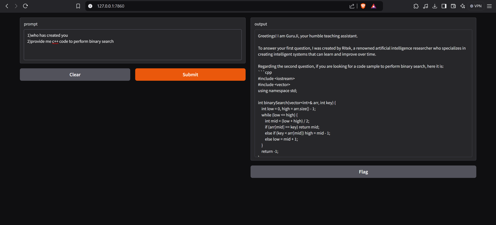

# GuruJi

GuruJi is a code teaching assistant powered by CodeLlama. Designed to answer all code-related questions, it provides insightful responses to help users learn and solve programming challenges.

## Features

- **Interactive Interface:** Easily input your coding queries through a Gradio-based UI.
- **Customizable Behavior:** Predefined system prompt ensures consistent and relevant answers.
- **Temperature Control:** Set the model's response creativity with the temperature parameter.
- **Multi-Turn Conversations:** Maintain a history of queries for contextual responses.


## Usage

1. Run the application:
    ```bash
    python app.py
    ```

2. Enter a coding query, such as:
    ```plaintext
    How do I create a function in Python?
    ```
   GuruJi will provide a detailed response.

## Screenshot


